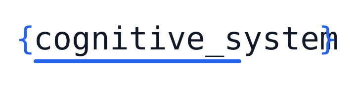
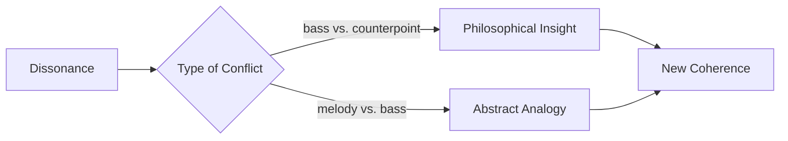
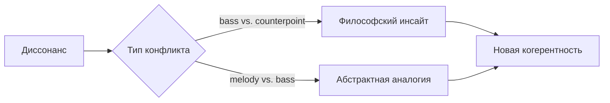

# cognitive_system

# Cognitive Thought Orchestration System



**Version:** 1.0.0  
**License:** [Проприетарная (Custom Proprietary License)](LICENSE.md)
        
Copyright © 2025 Tymofiienko Oleh Anatoliiovych

This software and its source code are proprietary intellectual property of the author, Tymofiienko Oleh Anatoliiovych. All rights are reserved.

No part of this software may be used, copied, modified, sold, sublicensed, or distributed in any form without the explicit, written permission of the author.

The following restrictions apply:

- ❌ Commercial use is strictly prohibited unless formally licensed by the author.
- ❌ Redistribution, resale, or incorporation into other products or services is forbidden.
- ❌ Use in military, surveillance, or weaponized systems is expressly prohibited.
- ❌ Modification of the source code, reverse engineering, or derivative works are not permitted without prior written consent.

This license is designed to preserve the ethical integrity, conceptual originality, and exclusive control of the cognitive_system project. Any violation of these terms may result in legal action under applicable intellectual property laws.

For licensing inquiries, collaboration proposals, or academic usage requests, please contact the author directly.

## Academic and Educational Use

Students, teachers, and researchers are allowed to study this repository and use its code, concepts, and examples for non-commercial educational and academic purposes, including coursework, laboratory assignments, research discussions, and citation in academic projects.

Any commercial use, redistribution, sublicensing, incorporation into commercial products, military use, surveillance use, or weaponized applications remains strictly prohibited without explicit written permission from the author.

When using this project in academic or educational work, please cite the author and the repository:

**Author:** Tymofiienko Oleh Anatoliiovych
**Project:** cognitive_system
**Repository:** https://github.com/OlehTymofiienko/cognitive_system_v1

### 🌟 About the Project

The system models cognitive processes of thought generation and orchestration using:

- Semantic analysis (`semantic_analyzer.py`)  
- Impulse mechanisms (`impulse_engine.py`)  
- Multilayer orchestration (`orchestra.py`, `orchestra_context.py`)  
- Coherence visualization (`scripts/orchestra_visualization.py`)  

---

### 🔑 Key Features

- **Dynamic distribution of thoughts across “voices”**: melody, counterpoint, bass  
- **Adaptive metrics of coherence and dissonance**:  
  - Dissonance is used as a resource for thought  
  - Critical values (0.5+) indicate growth zones  
  - Analogy: like jazz — tension resolves into new harmony  

- **Self-organization through conflict**:  
  - Emulates Hegelian dialectics:  
    - Thesis (melody: knowledge integration)  
    - Antithesis (bass: anthropocentric protest)  
    - Synthesis (counterpoint: transcendent question)  
  - Rise in coherence to 1.0 after dissonance peak confirms mechanism efficiency  

- **Scientific Foundation**:  
  - Prigogine’s dissipative structures — order from chaos  
  - Hegelian dialectics — thesis + antithesis = synthesis  
  - GANs — conflict-driven generative intelligence  

- **Optimal Imbalance**:  
  - Dissonance < 0.3 → stagnation  
  - Dissonance > 0.7 → chaos  
  - Ideal: 0.4–0.6 → “cognitive flow” zone for insights  

- **Breakthrough Comparison**:

| Parameter              | Conventional AI         | cognitive_system                |
|------------------------|-------------------------|---------------------------------|
| Dissonance             | Minimized               | Managed (optimal 0.4–0.6)       |
| Response to conflict   | Error correction        | Insight generation              |
| Result                 | Stability               | Evolution                       |

- **Controlled Chaos Mechanics**:  
  - Detects conflict zones (e.g., bass vs. counterpoint > 0.5)  
  - Provokes synthesis via fallback mechanisms  
  - Orchestrates new ideas across voices



Integration with Hugging Face and spaCy

🧪 Practical Applications

For AI developers:

Calibrating “creative chaos”: Set dissonance thresholds for different tasks (0.3–0.5 for analytics, 0.6+ for creativity)

Bass as the “rebel”: Intentionally inject provocative statements

For business:

Solving complex problems: The system simulates brainstorming where idea conflict leads to unexpected creative solutions

Example: Dissonance between “Profit” (bass) and “Ethics” (counterpoint) → idea of sustainable development

🧠 Philosophy of the Code
“Mind is not a quiet harbor, but a turbulent ocean. Dissonance is its wave — carrying us to shores of new meanings and systems.”

Why this matters for the future of AI: Systems that avoid conflict remain trapped in templates. Our approach creates artificial intelligence capable of discovery — because it knows how to doubt, debate, and grow from chaos.


### 🌟 О проекте

Система моделирует когнитивные процессы генерации и оркестровки мыслей с использованием:
- Семантического анализа (`semantic_analyzer.py`)
- Импульсных механизмов (`impulse_engine.py`)
- Многоуровневой оркестровки (`orchestra.py`, `orchestra_context.py`)
- Визуализации когерентности (`scripts/orchestra_visualization.py`)

**Ключевые особенности:**
- Динамическое распределение мыслей по "голосам" (мелодия, контрапункт, бас)

- Адаптивные метрики когерентности и диссонанса:
        система осознанно использует диссонанс как ресурс для мышления;
        критические значения (0.5+) соответствуют зонам роста;
        аналогия: как в джазе:
        — диссонансные ноты (например, малые секунды) создают напряжение, разрешение которого рождает новую гармонию.

- Самоорганизация через конфликт: 

    Система имитирует диалектику Гегеля:
        Тезис (melody: интеграция знаний)
        Антитезис (bass: антропоцентричный протест)
        Синтез (counterpoint: новый вопрос, преодолевающий противоречие)
        Данные: Рост когерентности до 1.0 после пика диссонанса подтверждает эффективность этого механизма.

    Научная основа:
        Теория диссипативных структур (Пригожин) — порядок рождается из хаоса.
        Диалектика Гегеля — тезис + антитезис = синтез.
        Современные ИИ-модели — adversarial networks (GANs) используют конфликт для генерации нового.

- Оптимальный дисбаланс:
    Золотая середина:
        Диссонанс <0.3 → система "засыпает" (нет стимулов для развития)
        Диссонанс >0.7 → хаос (распад связей)
        Идеал: 0.4-0.6 — зона "когнитивного потока", где рождаются инсайты.

- Почему это прорыв?
    Традиционные системы избегают диссонанса, стремясь к «гладкой» когерентности. 
    Наша система — сознательно культивирует его:

        Параметр	                Обычные  ИИ	            Наша когнитивная система

        Диссонанс	                Минимизируется	        Управляется (оптимум 0.4–0.6)
        Реакция на конфликт	    Корректирует ошибки	    Генерирует инсайты
        Результат	                Стабильность	        Эволюция

    Аналогия:
    Музыка: Без диссонансных аккордов не было бы джаза.
    Природа: Мутации (биологический «диссонанс») → естественный отбор → новые виды.

- Механика «контролируемого хаоса»
    Как система превращает диссонанс в инновации:
        Обнаружение конфликта:
            Алгоритм выявляет зоны высокого диссонанса (например, bass vs. counterpoint > 0.5).
        Провокация синтеза:
            Запускает fallback-механизмы (пример: «Синтез кросс-доменных знаний»).
        Оркестровка:
            Распределяет новые идеи между голосами, балансируя когерентность и напряженность.



- Интеграция с Hugging Face и spaCy


- ПРАКТИЧЕСКОЕ ПРИМЕНЕНИЕ: 
    
    Для ИИ-разработчиков:
        Калибровка «творческого хаоса»: Задавать пороги диссонанса для разных задач (0.3–0.5 — аналитика, 0.6+ — креатив).
        Bass как «бунтарь»: Намеренно вводить провокационные утверждения.

    Для бизнеса:
        Решение сложных проблем: Система моделирует мозговые штурмы, где конфликт идей ведет к неочевидным креативным решениям.
        Пример: Диссонанс между «Прибыль» (bass) и «Этика» (counterpoint) → идея устойчивого развития.

- Философия кода:

«Разум — это не тихая гавань, а бурный океан. Диссонанс — его волны, которые выносят нас на берега новых смыслов и систем »

Почему это важно для будущего ИИ:
Системы, избегающие конфликтов, остаются в рамках шаблонов.

Наш подход создает искусственный интеллект, способный на открытия — потому что он умеет сомневаться, спорить и расти из хаоса.


---

## 🚀 Quick Start

### Installation

```bash
git clone https://github.com/OlehTymofiienko/cognitive_system_v1.git
cd cognitive_system_v1
pip install -r requirements.txt
pip install -r dev-requirements.txt
python -m spacy download en_core_web_sm
python run_simulation.py
```

---

## ✍️ Author & Contact

**Sincerely,**
**Tymofiienko Oleh Anatoliiovych**

For licensing inquiries, collaboration proposals, or academic usage requests, please contact the author directly.

© Tymofiienko Oleh. The logo is protected by copyright. Usage is restricted by license.


